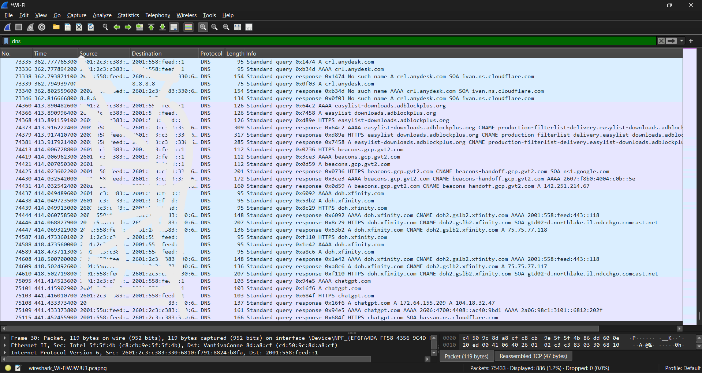
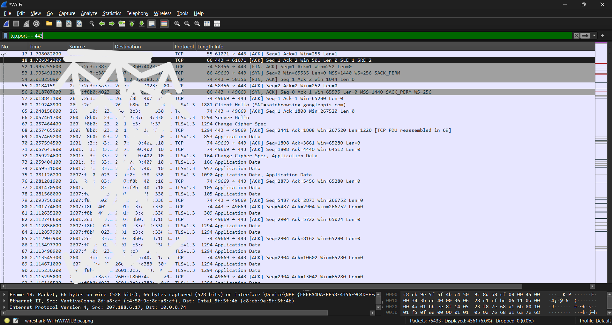
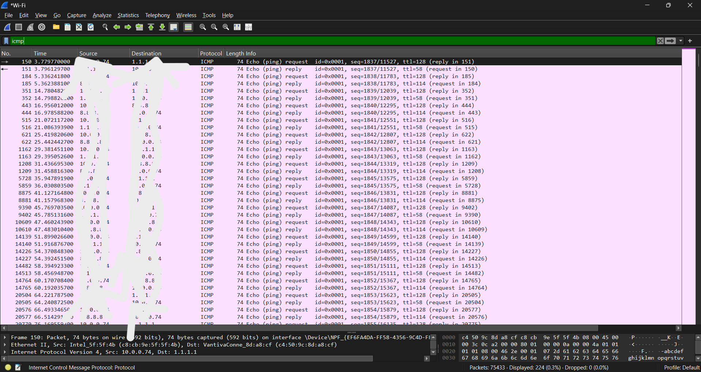
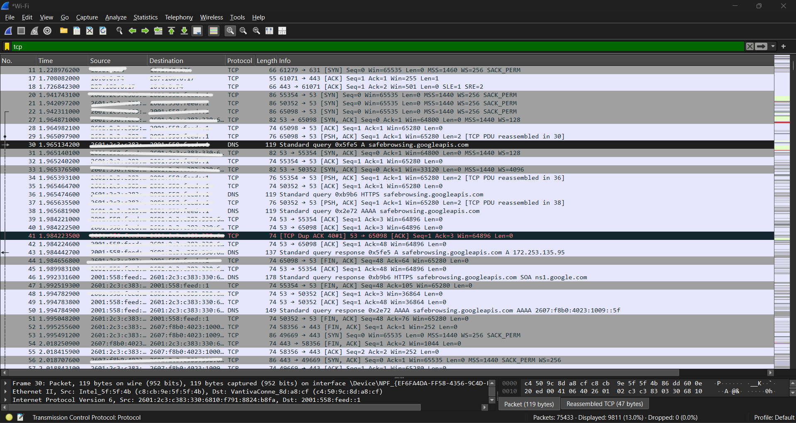

# Network Traffic Analysis

## Overview

This section demonstrates network traffic monitoring and analysis using Wireshark.

The objective is to capture and analyze common network protocols, identify normal traffic patterns, and recognize activity that may require further security investigation.

## Tool Used

- Wireshark

## Protocols Analyzed

- DNS
- TCP
- HTTP/HTTPS
- ICMP

---

## 1. DNS Traffic Analysis

Wireshark display filter:

`dns`

### Objective

Analyze DNS queries and responses generated by a client system.

### Items Reviewed

- Source IP address
- Destination DNS server
- Requested domain
- DNS query type
- Response code
- Resolved IP address

### Security Relevance

DNS monitoring can help identify:

- Unusual domain requests
- Repeated failed DNS queries
- Unexpected DNS servers
- Suspicious domain activity

---

## 2. TCP Traffic Analysis

Wireshark display filter:

`tcp`

### Objective

Observe TCP communication between hosts.

### TCP Three-Way Handshake

Client → Server: SYN

Server → Client: SYN-ACK

Client → Server: ACK

This establishes a TCP connection before application data is exchanged.

### Security Relevance

TCP analysis can help identify:

- Repeated connection attempts
- Connection failures
- Unexpected ports
- Abnormal communication patterns

---

## 3. HTTPS Traffic

Wireshark display filter:

`tcp.port == 443`

### Objective

Identify encrypted web traffic between a client and external services.

HTTPS protects application data using TLS encryption.

The payload is encrypted, but network-level information such as source/destination addresses and connection behavior can still be analyzed.

---

## 4. ICMP Traffic

Wireshark display filter:

`icmp`

### Objective

Observe ICMP echo requests and replies generated using ping.

Example:

User-PC → ICMP Echo Request → Server

User-PC ← ICMP Echo Reply ← Server

### Security Relevance

ICMP can be useful for network troubleshooting but may also appear during network discovery and reconnaissance.

---

## Example Investigation Workflow

When suspicious network activity is detected:

1. Identify the source IP address.
2. Identify the destination IP address.
3. Review the protocol and destination port.
4. Analyze connection frequency and timing.
5. Determine whether the communication is expected.
6. Correlate activity with firewall or security logs when available.
7. Document findings.
8. Escalate suspicious activity when necessary.

---

## Lab Evidence

The following packet captures were generated during the authorized home-lab exercise using Wireshark.

### 1. DNS Traffic Analysis

The DNS capture demonstrates DNS queries and responses between the client and DNS resolver. The analysis includes A/AAAA record lookups, query responses, and domain-resolution activity.

**Display filter:**

`dns`

**Observation:** DNS traffic can be analyzed to identify requested domains, DNS servers, response codes, and unusual resolution activity.

---

### 2. HTTPS / TLS Traffic Analysis

The HTTPS capture demonstrates TCP port 443 communication and TLS 1.3 traffic, including Client Hello, Server Hello, and encrypted application data.

**Display filter:**

`tcp.port == 443`

**Observation:** HTTPS payloads are encrypted, but connection metadata such as source/destination addresses, ports, TLS negotiation, and communication patterns remain available for network analysis.

---

### 3. ICMP Traffic Analysis

ICMP traffic was generated to validate network connectivity. The capture shows echo requests from the client and corresponding echo replies from the destination.

**Display filter:**

`icmp`

**Observation:** ICMP analysis can assist with connectivity troubleshooting and can also help identify unusual network-discovery activity.

---

### 4. TCP Traffic Analysis

TCP traffic was captured to examine connection establishment and normal TCP communication behavior.

**Display filter:**

`tcp`

**Observation:** TCP analysis can help identify SYN packets, SYN-ACK responses, ACK packets, connection failures, resets, and unexpected destination ports.

---

## Expected Result

The traffic analysis should demonstrate the ability to identify common network protocols, understand normal communication patterns, apply Wireshark display filters, and investigate potentially suspicious network activity.

## Security Note

All packet captures used in this project are generated within an authorized lab environment. No confidential or production network traffic is included.
